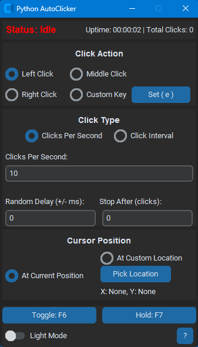

# Python AutoClicker

A versatile and customizable autoclicker and auto-key-presser built with Python and CustomTkinter. This application provides a clean, modern interface for automating mouse clicks and keyboard actions. Works only with the US QWERTY Layout.



---
## ## Features
- **Flexible Action Target:** Choose between Left, Middle, Right mouse clicks, or set a custom keyboard key.
- **Advanced Key Recording:** The "Set Key" feature can record complex actions, including shifted characters (e.g., `!`, `{`) and modifier keys (e.g., `Shift`, `Ctrl`, `Alt`).
- **Two Timing Modes:** Configure actions to occur by **Clicks Per Second** (up to 200) or at a specific **Click Interval** (hours, minutes, seconds, milliseconds).
- **Precise Cursor Control:** Actions can be performed at the current cursor location or locked to a specific, pre-selected screen coordinate.
- **Configurable Hotkey:** Set a custom global hotkey to start and stop the application's action.

---
## ## How to Run
1.  **Clone the repository:**
    ```sh
    git clone https://github.com/Sonic1901/25Summer-Autoclicker.git
    cd python-autoclicker
    ```
2.  **Create a virtual environment (recommended):**
    ```sh
    python -m venv venv
    venv\Scripts\activate
    ```
3.  **Install dependencies:**
    ```sh
    pip install -r requirements.txt
    ```
4.  **Run the application:**
    ```sh
    python main.py
    ```

---
## ## Building the `.exe`
To create a standalone executable for Windows:

1.  **Ensure PyInstaller is installed:**
    ```sh
    pip install pyinstaller
    ```
2.  **Run the build command from your project directory:**
    ```sh
    pyinstaller --name "PythonAutoClicker" --onefile --windowed --noconsole main.py
    ```
3.  **Find your application** in the `dist` folder that is created.

---
## ## License
This project is licensed under the MIT License - see the [LICENSE](LICENSE) file for details.
